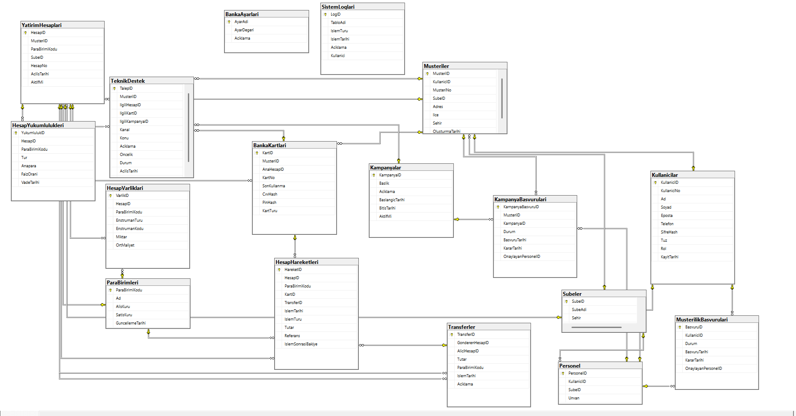

# 🏦 BankProjectDb  
### Advanced Relational Banking Simulation – SQL Server

A fully relational banking database system built using Microsoft SQL Server and T-SQL.

This project simulates real-world financial operations with transaction-safe business logic, trigger-based safeguards, and strict relational integrity.

---

## 📌 Project Overview

The system models a simplified banking infrastructure including:

- Customer & Personnel Management
- Multi-currency investment accounts
- Money Transfers
- Foreign Exchange Operations
- Investment Transactions
- Credit/Debit Card Management
- Campaign & Application Management
- Technical Support Tracking
- Audit Logging System

The focus of this project is **data integrity, transactional safety, and real-world financial modeling principles.**

---

## 🏗 Architecture Design

The database is structured with:

- Normalized relational schema
- Foreign Key constraints
- Unique constraints
- Check constraints
- Default constraints
- Business rule triggers
- Transaction-safe stored procedures
- Demonstration test scenarios

---

## 📂 Project Structure

```
/
├── README.md
├── docs/
│   └── rapor.pdf
├── images/
│   └── diagram.png
└── scripts/
    ├── 00_database.sql
    ├── 01_schema.sql
    ├── 02_constraints.sql
    ├── 03_triggers.sql
    ├── 04_procedures.sql
    ├── 05_seed.sql
    └── 06_demo_scenarios.sql
```

---

## ⚙️ Execution Order

Run scripts in the following order:

1. 00_create_db.sql
2. 01_schema.sql
3. 02_constraints.sql
4. 03_triggers.sql
5. 04_procedures.sql
6. 05_seed.sql
7. 06_demo_scenarios.sql

---

## 🛡 Data Integrity Mechanisms

### ✔ Referential Integrity
All critical entities are connected with foreign keys.

### ✔ Financial Safety
- Transfers executed inside transactions
- Balance validation before debit operations
- Currency mismatch prevention
- Historical transaction immutability

### ✔ Trigger-Based Protection
- Prevent invalid campaign dates
- Prevent modification of historical financial records
- Prevent physical deletion of bank accounts
- Automatic audit logging

---

## 💳 Implemented Stored Procedures

- `sp_ParaTransferi`
- `sp_DovizIslemi`
- `sp_YatirimAlimi`
- `sp_KartBorcOdeme`

Each procedure includes:

- TRY/CATCH error handling
- Transaction management
- Business rule validation
- Logging logic

---

## 🧪 Demo Scenarios

The `06_demo_scenarios.sql` script demonstrates:

- Successful money transfer
- Transfer failure (insufficient balance)
- Currency mismatch validation
- Foreign exchange transaction
- Investment purchase
- Card debt payment
- Trigger validation tests

---

### Entity Relationship Diagram (ERD)



---

## 🧠 Design Philosophy

This project was designed with production-style database principles:

- Set-based logic
- Transaction-safe operations
- Business logic encapsulation
- Clear separation of schema and behavior
- Idempotent deployment structure

---

## 🛠 Technologies Used

- Microsoft SQL Server
- T-SQL
- Query Store
- Transaction management
- Trigger design

---

## 🚀 Why This Project Matters

This project demonstrates:

- Advanced relational modeling
- Financial transaction integrity
- Real-world banking system logic
- Enterprise-style database organization


---

📄 [Full Technical Report (PDF)](docs/rapor.pdf)
---

## 👥 Contributors

- Emirhan Efe Gözpınar
- Mustafa Hayrullah Yıldız
- Şeyhmus Elik

Project developed collaboratively as part of an academic database systems study.
